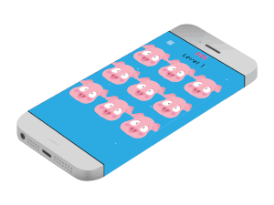

# Find it if you can

The goal of this game is for you to find the picture the differs from the other 8.

How to play the game:
When you start the game, you will be shown nine pictures. They all seem to be similar, but there is one that has a slight difference. As shown in the above snapshot.

You have 15 seconds to find the picture that does not belong to the group. If you fail, you will lose.

Currently, the game has seven levels.